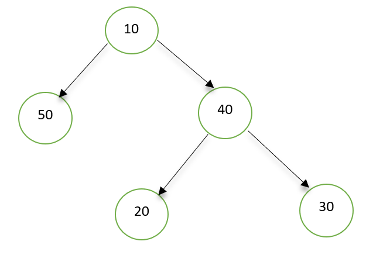
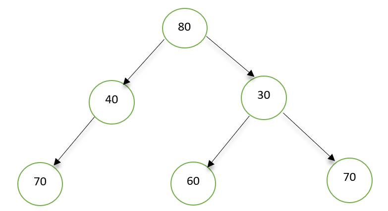

# Kth common ancestor in BST
Given a BST with n (n>=2) nodes, find the kth common ancestor of nodes x and y in the given tree. Return -1 if kth ancestor does not exists.
Nodes x and y will always be present in input BST, and x != y.

## Problem Statement:-
https://www.geeksforgeeks.org/problems/kth-common-ancestor-in-bst/1

### Example 1:
#### Input: 
Input tree

k = 2, x = 20, y = 30 
#### Output:
10
#### Explanation:
LCA of 20 and 30 is 40 and their 2nd common ancestor is 10.

### Example 2:
#### Input: 
Input tree

k = 2, x = 70, y = 60
#### Output:
-1
#### Explanation:
LCA of 70 and 60 is 80, which is root itself. There does not exists 2nd common ancestor in this case.

### Your task :
You don't have to read input or print anything. Your task is to complete the function kthCommonAncestor() that takes the root of the tree, k, x and y as input and returns the kth common ancestor of x and y.
 
###### Expected Time Complexity: O(Height of the BST)
###### Expected Space Complexity: O(Height of the BST)
 
### Your Task :
1 <= n, k <= $`10^5`$
1 <= node->data, x, y <= $`10^9`$